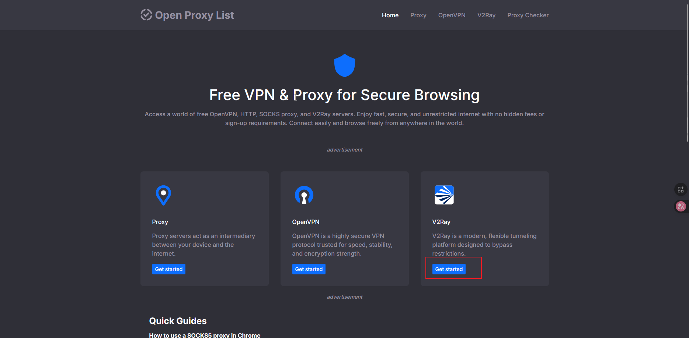
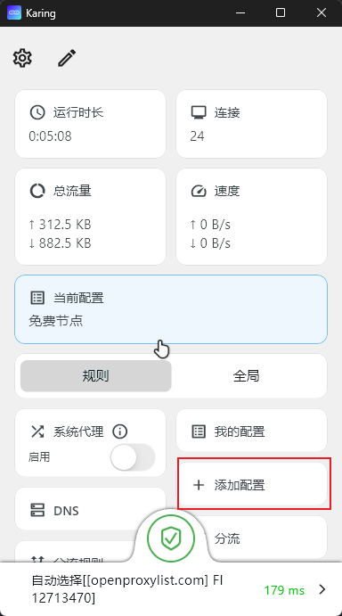
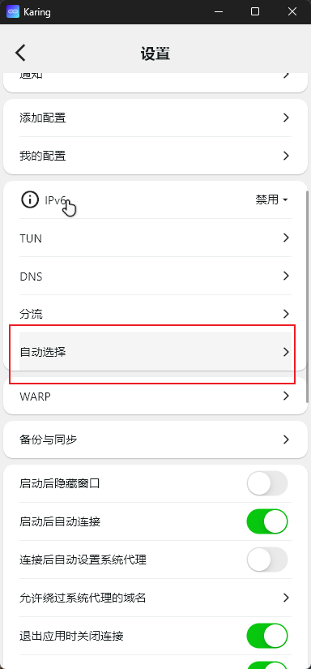

## 地址及客户端
节点地址 [OpenProxyList](https://openproxylist.com/)

[客户端](https://karing.app/)

## karing 客户端配置
### 一. 从OpenProxyList 复制节点链接

点击V2Ray Subscription按钮，然后等待加载完成后。复制浏览器地址栏链接地址

### 二. 打开 karing 客户端 

#### 1. 点击添加配置 -> 添加配置链接
将复制的节点链接粘贴到添加配置链接输入框中

#### 2. 开启下方三个选项，然后点击右上角保存
 - **配置更新后重新加载**
 - **配置自动更新后启动延迟检测**
 - **自动移除延迟检测失败的服务器**

### 三. 设置自动移除无效服务器
#### 1.在首页点击左上角配置按钮，进入设置页面，下滑找到自动选择

#### 2.在自动选择配置页面开启以下选项
 - **网络变化时重新检测**
 - **手动延时检测后更新当前服务器**
 - **过滤无效服务器**

